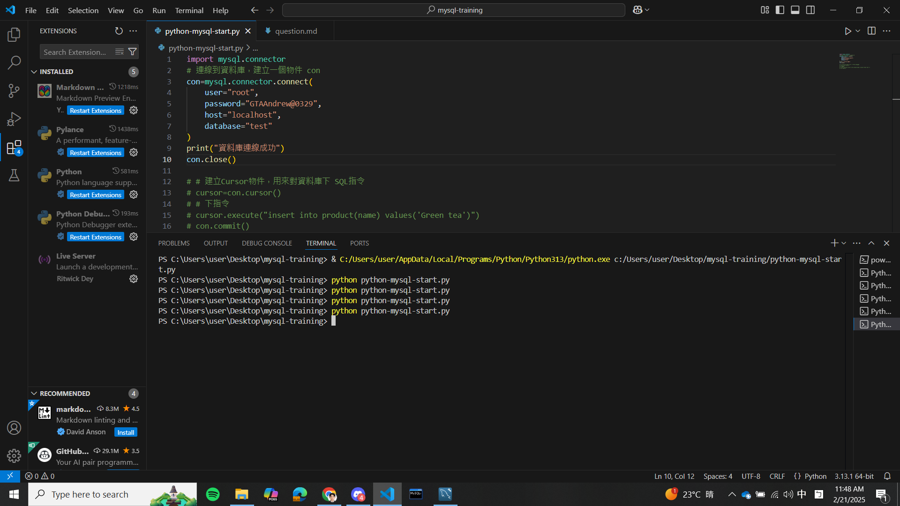
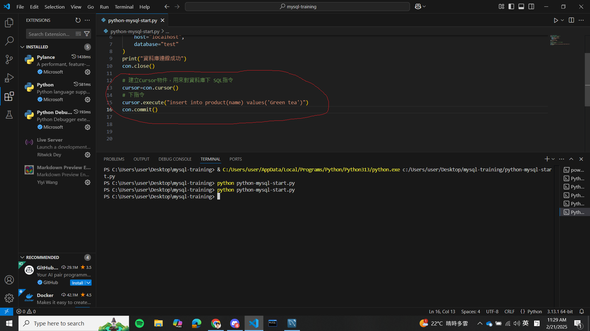

## 作業疑問
### 我遇到的問題
在昨天觀看彭彭老師的python連線到資料庫的教學影片中，有試著跟著影片的內容實作一次，但是不知為何無法列印出結果，所以我懷疑是程式在連線的過程中有出現錯誤，執行程式的方式皆為在終端機輸入:
python python-mysql-start.py

1.關閉所有的擴展套件(彭彭老師的建議):問題依舊存在

2.有確認過伺服器已經在 localhost 啟動，並且帳號、密碼都是正確的。

3.試試看是否能透過建立cursor物件(紅筆圈起來的內容)來修改資料庫的內容:登入mysql查看test資料庫，結果也是不行的

4.在過程中，程式皆無任何噴錯

