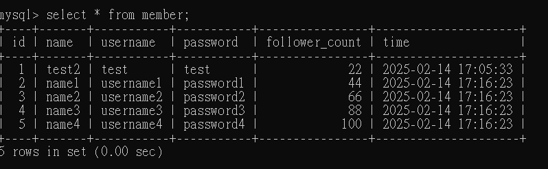
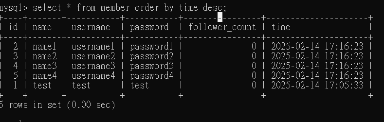
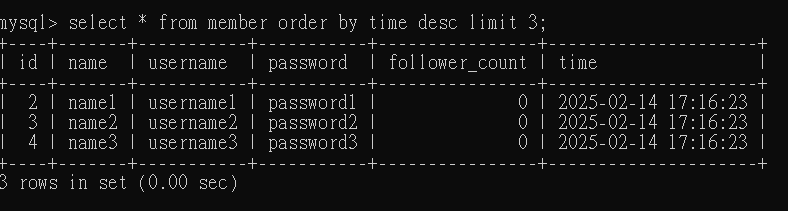

# 第五周作業:
## Task 2:
● Create a new database named website

● Create a new table named member, in the website database

## Task 3:
● INSERT a new row to the member table where name, username and password must be set to test. INSERT additional 4 rows with arbitrary data.

  

● SELECT all rows from the member table

● SELECT all rows from the member table, in descending order of time.

 

● SELECT total 3 rows, second to fourth, from the member table, in descending order of time(先手動更新時間欄位)

● SELECT rows where username equals to test.

● SELECT rows where name includes the es keyword

● SELECT rows where both username and password equal to test.

  

● UPDATE data in name column to test2 where username equals to test.

    
